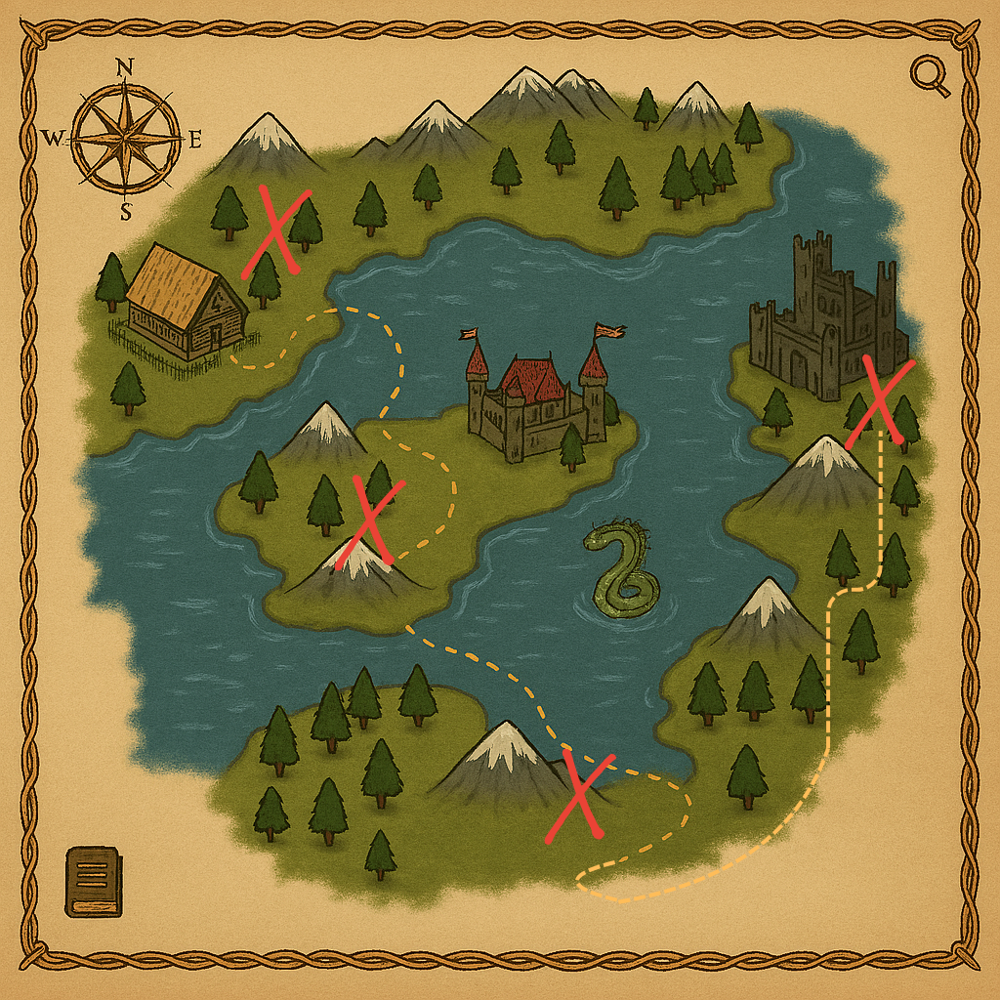

# hackwest2025
WordCrusader

This project is a medieval-themed word game where players must guess letters to reveal hidden words before time runs out. Each wrong guess costs a heart, and players only have one minute per level to solve the word. The game spans four levels, each guarded by a unique boss that challenges the player’s skill and speed.

We drew inspiration from classic word-guessing games and gave it a fresh twist with a medieval theme, bosses, and timed challenges to raise the stakes. To speed up development, we used Gemini to generate a fast foundation for our idea, allowing us to spend more time refining and implementing the features we envisioned.

  

